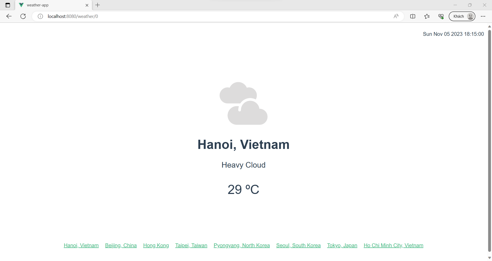
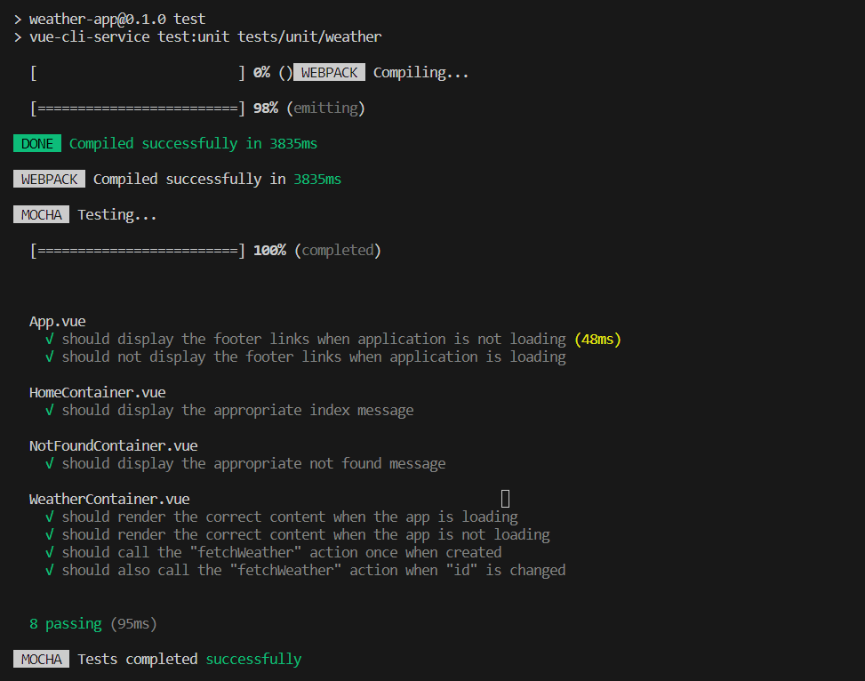

<a name="readme-top"></a>
<!-- TABLE OF CONTENTS -->
<details>
  <summary>Table of Contents</summary>
  <ol>
    <li>
      <a href="#about-the-project">About The Project</a>
      <ul>
        <li><a href="#built-with">Built With</a></li>
      </ul>
    </li>
    <li>
      <a href="#getting-started">Getting Started</a>
      <ul>
        <li><a href="#prerequisites">Prerequisites</a></li>
        <li><a href="#installation">Installation</a></li>
        <li><a href="#project-setup">Project Setup</a></li>
      </ul>
    </li>
    <li><a href="#key-features">Key Features</a></li>
    <li><a href="#usage">Usage</a></li>
    <li><a href="#contact">Contact</a></li>
  </ol>
</details>

<p align="center">
    &nbsp;
    &nbsp;
    &nbsp;
    &nbsp;
    &nbsp;
    &nbsp;
    &nbsp;
    &nbsp;
    &nbsp;
    &nbsp;
</p>

# About The Project
A simple a weather application that tells us the current day's weather forecast in certain cities across the world. The goal is to understand of how tests can be done for an app that relies on a web request to an API and is integrated with Vuex and Vue Router - using ***Mocha***, ***Chai*** and ***Sinon***.

Based on chapter 9 of the book "**Fullstack Vue 3**", with some changes!

## Built With
* [![HTML5][HTML5-shield]][HTML5-url]
* [![CSS3][CSS3-shield]][CSS3-url]
* [![JavaScript][JavaScript-shield]][JavaScript-url]
* [![Node.js][Node.js-shield]][Node.js-url]
* [![Express][Express-shield]][Express-url]
* [![Vue.js][Vue.js-shield]][Vue.js-url]
* [![Bulma][Bulma-shield]][Bulma-url]
* [![Mocha][Mocha-shield]][Mocha-url]
* [![Chai][Chai-shield]][Chai-url]

<p align="right">(<a href="#readme-top">back to top</a>)</p>

# Getting Started

## Prerequisites
Before cloning and using this application, you'll need to install these things on your computer:
* [Node.js](https://nodejs.org/en/download/): a single-threaded, open-source, cross-platform runtime environment for building fast and scalable server-side and networking applications. It runs on Chrome's V8 JavaScript runtime engine, and it uses event-driven, non-blocking I/O architecture, which makes it efficient and suitable for real-time applications.
* [npm](https://docs.npmjs.com/about-npm): the default package manager for the JavaScript runtime environment Node.js. It consists of a command line client, also called npm, and an online database of public and paid-for private packages, called the npm registry. The registry is accessed via the client, and the available packages can be browsed and searched via the npm website.
* [Vue](https://vuejs.org/): a JavaScript framework for building user interfaces. It builds on top of standard HTML, CSS, and JavaScript and provides a declarative and component-based programming model that helps you efficiently develop user interfaces, be they simple or complex.
* [Visual Studio Code](https://code.visualstudio.com/download): You can choose any IDE or Text Editor that you want. To build a simple application like this, I recommend <b>Visual Studio Code</b>.

## Installation
You can install this application by cloning this repository into your current working directory:
```sh
git clone https://github.com/theEmperorofDaiViet/weather-app.git
```
After cloning the repository, you can open the project by Visual Studio Code.

## Project setup
```
npm install
```

### Adds unit-mocha plugin for vue-cli
```
vue add unit-mocha
```

### Compiles and hot-reloads for development
```
npm run serve
```

### Compiles and minifies for production
```
npm run build
```

### Boot the app
```
npm run start
```
The Node and Webpack servers are now running - watch the console output for instructions. Your entire application is now available at [http://localhost:8080/](http://localhost:8080/)

### Lints and fixes files
```
npm run lint
```

### Runs the test
```
npm run test
```

### Runs the tests in watch mode
```
npm run test:watch
```

### Customize configuration
See [Configuration Reference](https://cli.vuejs.org/config/).

<p align="right">(<a href="#readme-top">back to top</a>)</p>

# Key Features

### Vue:
  - The homepage displays the message ‘***Pick a city below to see the weather!***’.
  + Some links at the foot of the screen, each one represents a city.
  - Clicking any of those links will rerender the message to display weather details of the selected city:
    - City's name
    - Time of the latest update - in the specified location's time zone
    - Weather illustration image
    - Weather description
    - Temperature

### Node server: 
The server provides a single API call to the client. When the [/weather](/) api call is made from the client side, the location (latitude and longitude) from request query is used to fetch real weather information with the help of the [Open-Meteo](https://open-meteo.com/) Weather API.

**Open-Meteo** is an open-source weather API and offers free access for non-commercial use. No API key required. Though they provide several endpoints to their [API](https://open-meteo.com/en/docs), we’re only using the
**forecast** endpoint.

In the book, the [MetaWeather](https://www.metaweather.com/) was used, but it's no longer available.

### Testing:
We will test whether:
- [App.vue](./tests/unit/weather/App.spec.js):
  - displays the footer links when the application is not loading.
  - doesn't display the footer links when the application is loading.
- [HomeContainer.vue](./tests/unit/weather/components/HomeContainer.spec.js): displays the appropriate index message.
+ [NotFoundContainer.vue](./tests/unit/weather/components/NotFoundContainer.spec.js): displays the appropriate not found message.
- [WeatherContainer.vue](./tests/unit/weather/components/WeatherContainer.spec.js):
  - renders the correct content when the application is loading.
  - renders the correct content when the application is not loading.
  - calls the "**fetchWeather**" action once when created.
  - also calls the "**fetchWeather**" action when "**id**" is changed.

<p align="right">(<a href="#readme-top">back to top</a>)</p>

# Usage
Our app looks like this:

<p align="center">
    
    
    
</p>

Run the tests:

<p align="center">
    
</p>

<p align="right">(<a href="#readme-top">back to top</a>)</p>

# Contact
You can contact me via:
* [![GitHub][GitHub-shield]][GitHub-url]
* [![LinkedIn][LinkedIn-shield]][LinkedIn-url]
* ![Gmail][Gmail-shield]:&nbsp;<i>Khiet.To.05012001@gmail.com</i>
* [![Facebook][Facebook-shield]][Facebook-url]
* [![Twitter][Twitter-shield]][Twitter-url]

<br/>
<p align="right">(<a href="#readme-top">back to top</a>)</p>

<!-- MARKDOWN LINKS & IMAGES -->
<!-- Tech stack -->
[HTML5-shield]: https://img.shields.io/badge/html5-%23E34F26.svg?style=for-the-badge&logo=html5&logoColor=white
[HTML5-url]: https://www.w3.org/html/
[CSS3-shield]: https://img.shields.io/badge/css3-%231572B6.svg?style=for-the-badge&logo=css3&logoColor=white
[CSS3-url]: https://www.w3.org/Style/CSS/
[JavaScript-shield]: https://img.shields.io/badge/JavaScript-323330?style=for-the-badge&logo=javascript&logoColor=F7DF1E
[JavaScript-url]: https://www.ecma-international.org/
[Node.js-shield]: https://img.shields.io/badge/node.js-6DA55F?style=for-the-badge&logo=node.js&logoColor=white
[Node.js-url]: https://nodejs.org
[Express-shield]: https://img.shields.io/badge/express.js-%23404d59.svg?style=for-the-badge&logo=express&logoColor=%2361DAFB
[Express-url]: https://expressjs.com/
[Vue.js-shield]: https://img.shields.io/badge/vuejs-%2335495e.svg?style=for-the-badge&logo=vuedotjs&logoColor=%234FC08D
[Vue.js-url]: https://vuejs.org/
[Bulma-shield]: https://img.shields.io/badge/Bulma-00D1B2?style=for-the-badge&logo=Bulma&logoColor=white
[Bulma-url]: https://bulma.io/
[Mocha-shield]: https://img.shields.io/badge/Mocha-8D6748?style=for-the-badge&logo=Mocha&logoColor=white
[Mocha-url]: https://mochajs.org/
[Chai-shield]: https://img.shields.io/badge/chai-A30701?style=for-the-badge&logo=chai&logoColor=white
[Chai-url]: https://www.chaijs.com/

<!-- Contact -->
[GitHub-shield]: https://img.shields.io/badge/github-%23121011.svg?style=for-the-badge&logo=github&logoColor=white
[GitHub-url]: https://github.com/theEmperorofDaiViet
[LinkedIn-shield]: https://img.shields.io/badge/linkedin-%230077B5.svg?style=for-the-badge&logo=linkedin&logoColor=white
[LinkedIn-url]: https://www.linkedin.com/in/khiet-to/
[Gmail-shield]: https://img.shields.io/badge/Gmail-D14836?style=for-the-badge&logo=gmail&logoColor=white
[Facebook-shield]: https://img.shields.io/badge/Facebook-%231877F2.svg?style=for-the-badge&logo=Facebook&logoColor=white
[Facebook-url]: https://www.facebook.com/Khiet.To.Official/
[Twitter-shield]: https://img.shields.io/badge/Twitter-%231DA1F2.svg?style=for-the-badge&logo=Twitter&logoColor=white
[Twitter-url]: https://twitter.com/KhietTo